# MURA Skeletal Imaging CNN

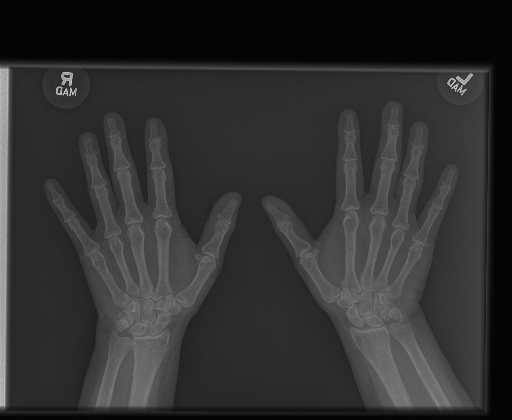

## Table of Contents

1. [Overview](#overview)
2. [Data](#data)
3. [First Glance](#first-glance)
4. [On to the full data set](#on-to-the-full-dataset)
5. [What next?](#what-next?)

## Overview

There are millions of new musculoskeletal conditions/injuries each year. With that comes a plethora of images and eye strain. The goal of this project was to create a Convolutional Neural Network that could assist Radiologists in classifying X-Rays as normal or abnormal. With the end goal of creating a network that can pass on a recommendation to a radiologist, hopefully reducing time to analyze the image, while increasing accuracy.

## Data

The data was obtained from the StanfordML group [here](https://stanfordmlgroup.github.io/competitions/mura/). The data was mostly images, with a couple of CSVs provided for image paths and targets.

The images were separated into training and validation sets, with further separation for each class of X-Ray: Finger, Hand, Wrist, Forearm, Elbow, Humerus, and Shoulder.

Within each subdirectory for image class, there were directories for each patient study, with the target being included in the patient directory name. This dataset was a mess of subdirectories. Notice that the target was labelled for each directory/patient study and not for each image.

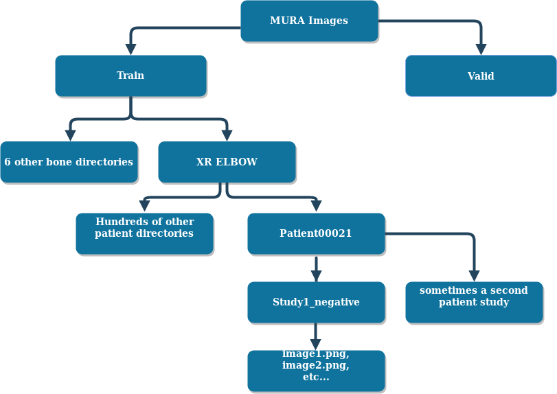

# First Glance
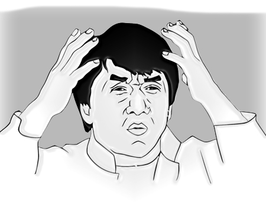

First I wanted to take a look at the directories, the number of images per directory, and the balance of my classes.

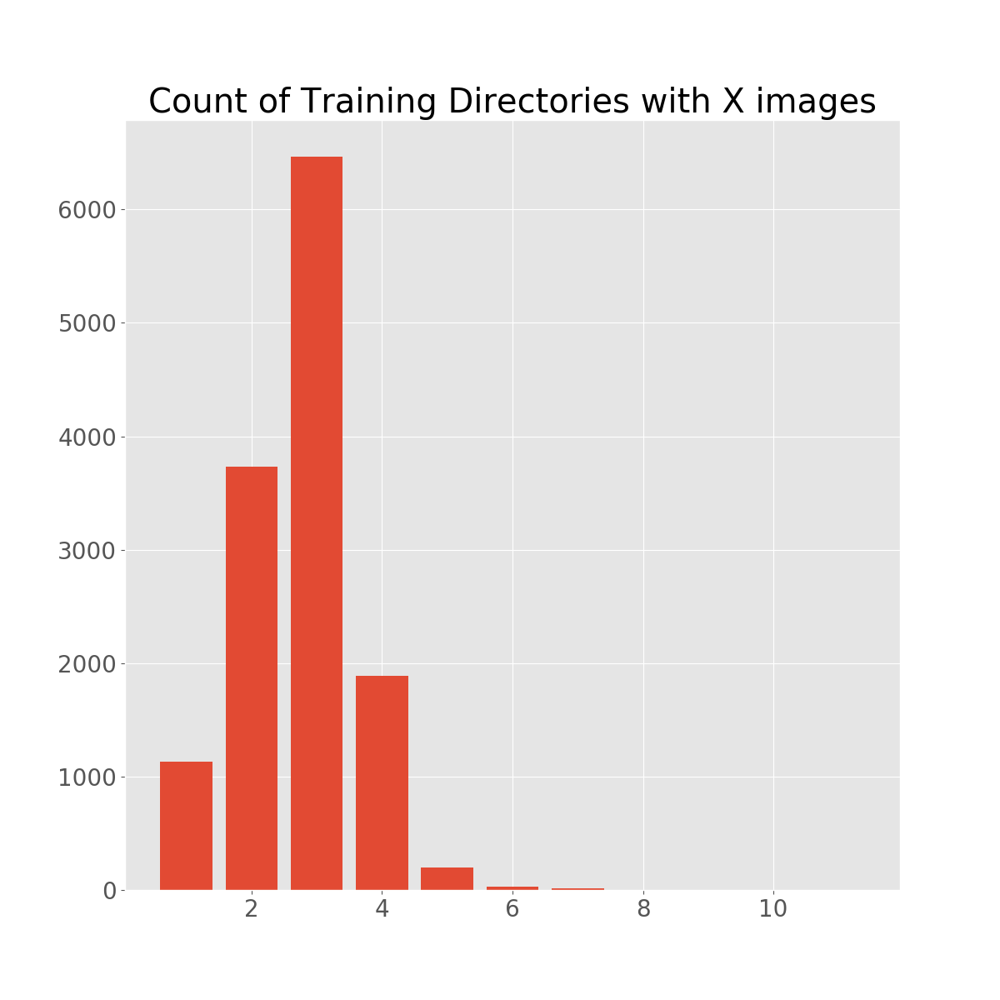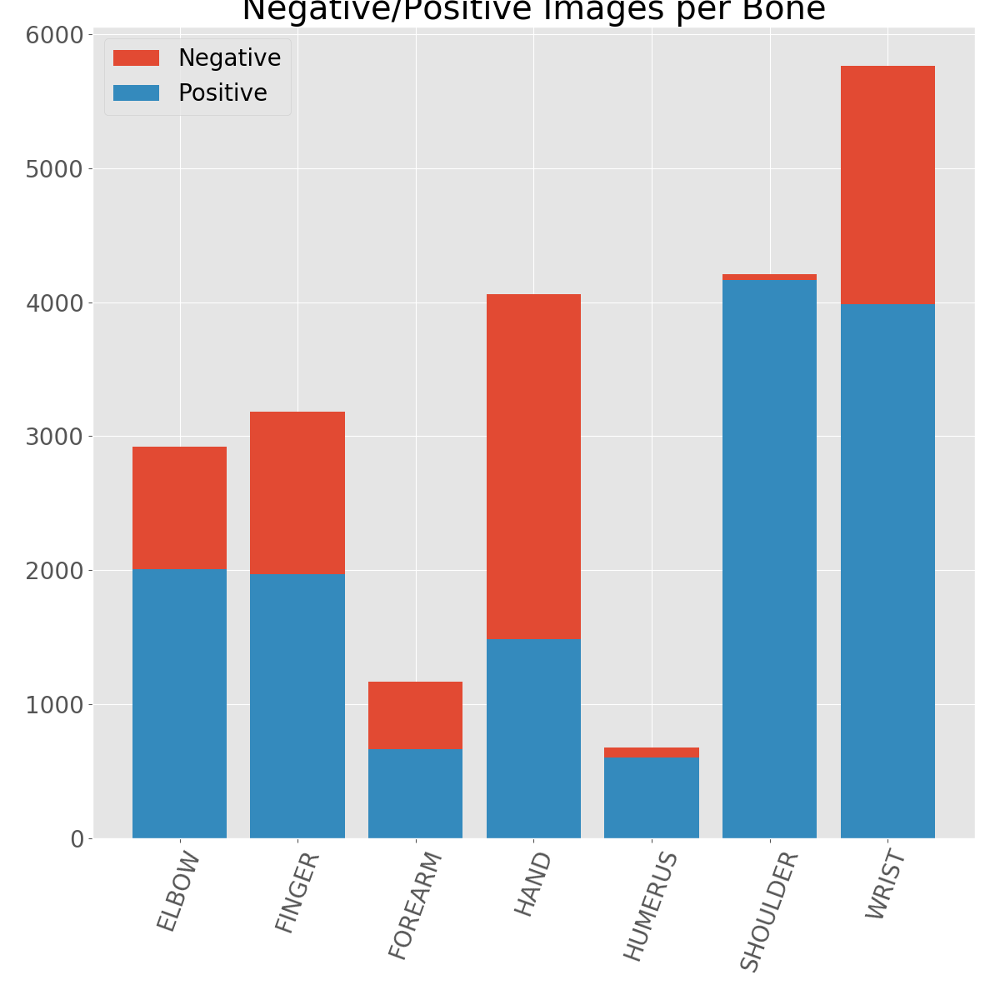

The images provided were all over the spectrum in terms of quality. There were images with multiple images, sometimes overlaying each other...

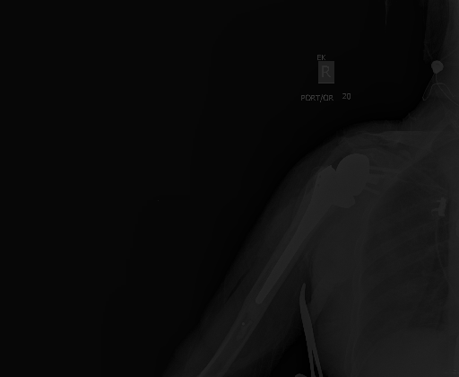
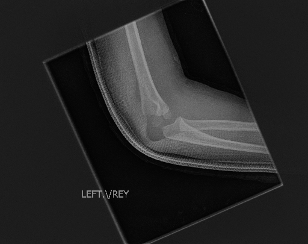

On the whole, the images were not as contrived as the first example, but their image quality, contrast, brightness, and placement were not very well controlled.

## Image Augmentation

From the initial EDA, I started to build my model, but before I got too far, I wanted to make sure my image augmentations were reasonable.

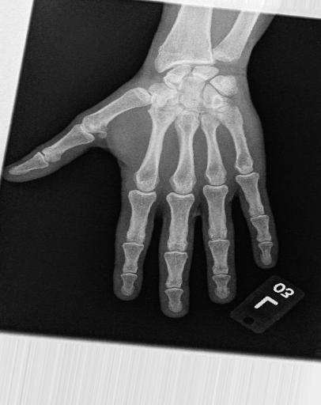

Looking good. On to selecting what image size to use. The initial paper provided from the data link used images that were 224x224. I certainly wanted to avoid that, so took a quick glance at my options.

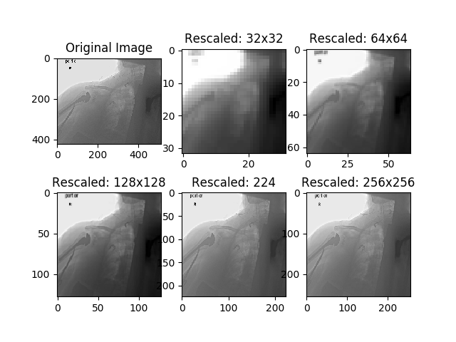

I felt that the 32x32 option wasn't going to cut it for this dataset, but thought I might be able to get away with the 64x64. Regardless, I tried all the options here at one point or another.

## Starting with the Forearm

I initially worked with the Forearm data because it was a smaller dataset that was not terribly balanced. I have been hesitant initially to balance classes with the organization of the files. Using this dataset, I tweaked my model, to find the best trade-off between image size, epochs, layers, and activations. In hindsight, I should have more time with multiple sets of images while tweaking the model.

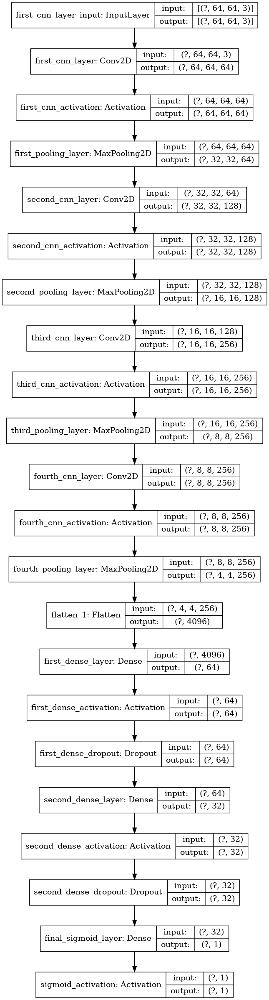

### Image size 32x32

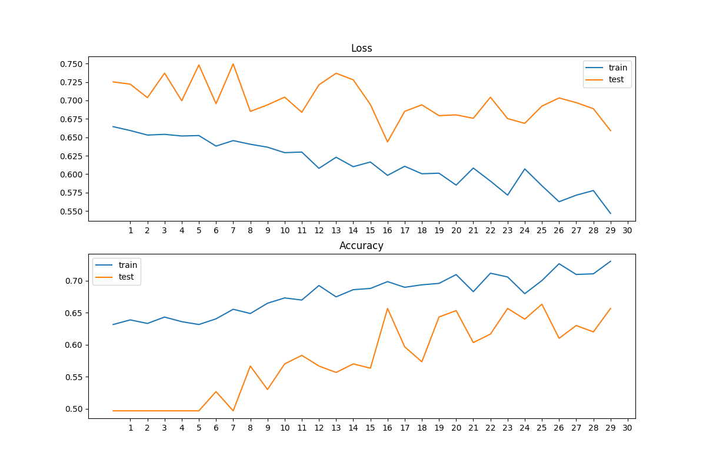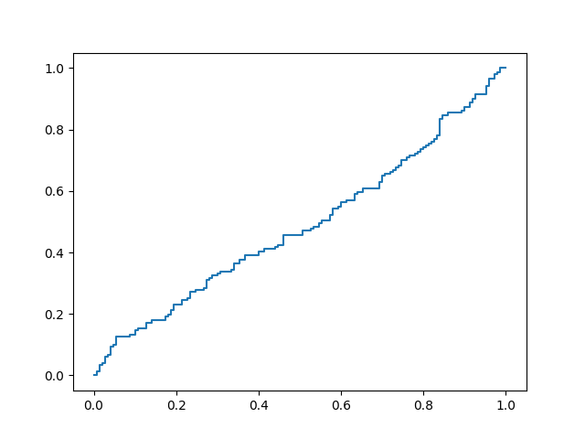

### Image size 64x64

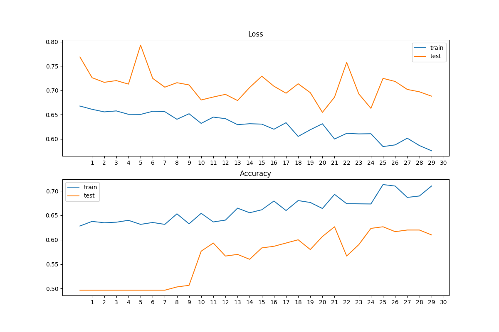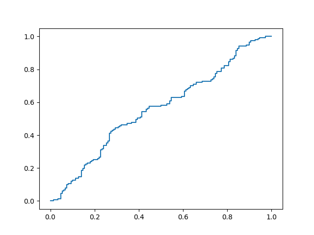

### Image size 128x128

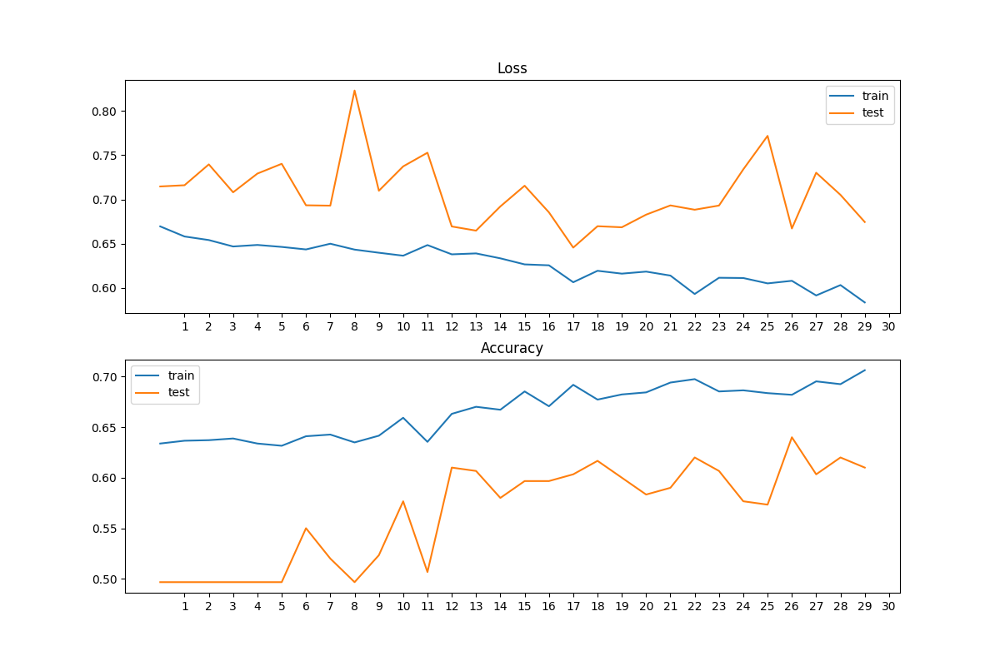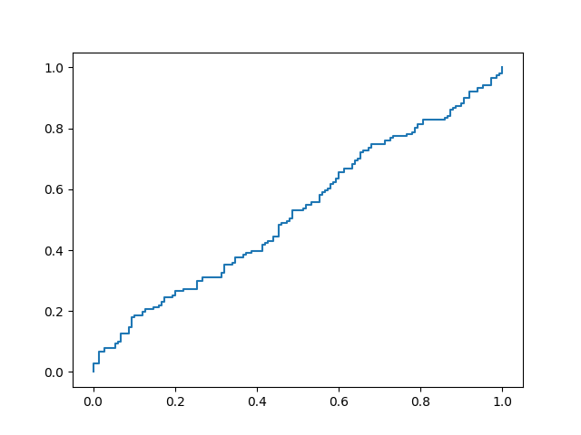

From all this exploration and model testing, I surmised that there was no reason to not go ahead with image size of 64x64.

As you can see, nothing looks super promising at this point, with all accuracy, loss, and ROC plots looking similar. There was also the issue of tons of False Negative. A typical exampe on the Forearm data would contain 20-30% of the predictions as FN.

# On to the full data set

At this point. I decided to use all positive and negative labels for all bones. I had initially held off on this, but then had the thought that breaks, fractures, and other abnormalities would share similar features, regardless of location.

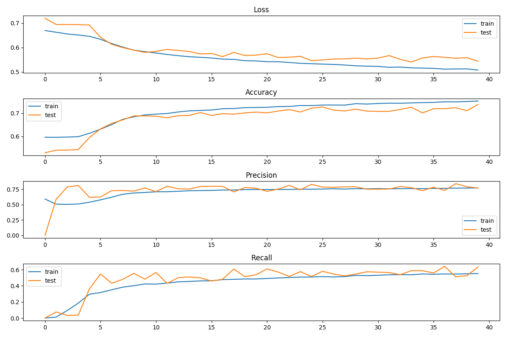

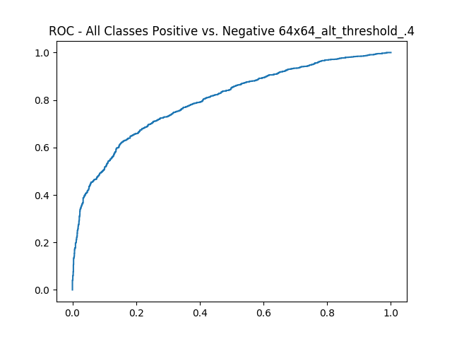

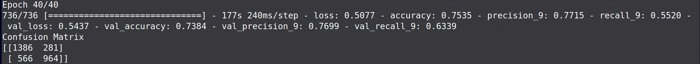

### Example of a bad False Negative
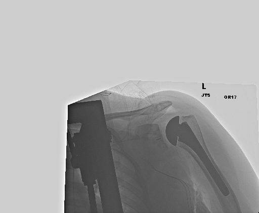

### Example of a False Negative that may not be wrong...

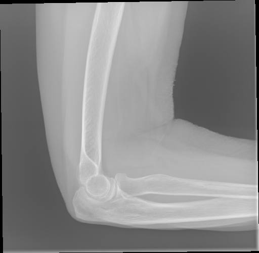

There are many images like this one. The concern is that since I labelled all images as positive/abnormal that were in a Positive Study directory, I may have created a number of False Negative. Similar issue for False Positives, but that is less concerning looking at the confusion matrix, and considering the repercussions of a False Positive in this scenario.

# What next?

- Find a way to treat each set of images for a study as a single image, or get a single prediction for a study.
- Figure out how to balance classes if treating each study as a single datapoint.
- Work on transfer learning, freezing layers, and building up the model.
- Use a pre-trained classification model to compare results.
- Apply some image visualization techniques to highlight the features the model is predicting on.
