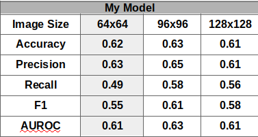
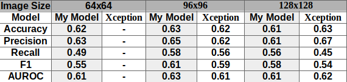

# MURA Skeletal Imaging CNN

## Table of Contents

1. [Overview](#overview)
2. [Data](#data)
3. [First Glance](#first-glance)
4. [On to the full data set](#on-to-the-full-dataset)
5. [What next?](#what-next?)

## Overview

There are millions of new musculoskeletal conditions/injuries each year. With that comes a plethora of images and eye strain. The goal of this project was to create a Convolutional Neural Network that could assist Radiologists in classifying X-Rays as normal or abnormal. With the end goal of creating a network that can pass on a recommendation to a radiologist, hopefully reducing time to analyze the image, while increasing abnormality recognition.

## Data

The data was obtained from the StanfordML group [here](https://stanfordmlgroup.github.io/competitions/mura/) - labelled MURA for *MU*sculoskeletal *RA*diography The data was mostly images, with a couple of CSVs provided for image paths and targets. The data included 15000 studies from 12000 patients, totalling 40.5 thousand images, split into 30000 training images, and 10000 testing images. These data were gathered beween 2001-2012.

The images were separated into training and validation sets, with further separation for each class of X-Ray: Finger, Hand, Wrist, Forearm, Elbow, Humerus, and Shoulder.

Within each subdirectory for image class, there were directories for each patient study, with the target being included in the patient directory name. This dataset was a mess of subdirectories. Notice that the target was labelled for each directory/patient study and not for each image.

# First Glance

First I wanted to take a look at the directories, the number of images per directory, and the balance of my classes.

The images provided were all over the spectrum in terms of quality. There were images with multiple images, sometimes overlaying each other...

On the whole, the images were not as contrived as the first example, but their image quality, contrast, brightness, and placement were not very well controlled.

## How to classify the data

I struggled for a long time with how to deal with classifying the data. My concern was that the data was labelled by study, not by image, and that within the same study, one image might show an obvious abnormality, while other images may not, since the view typically changes.

In the end, I self-assessed every image from a negative directory. My logic was that it would be quite easy for me to see obvious mislabelled images that were supposed to be positive, but the same would not be true for positive. I am not a trained Radiologist, and did not feel confident moving images labelled as positive to the negative category. After I scrubbed the data as best I could, moving hundreds of images from the negative to positive category, I then balanced classes.

## Examples of mislabelled images from Negative(normal) studies

## Image Augmentation

From the initial EDA, I started to build my model, but before I got too far, I wanted to make sure my image augmentations were reasonable.

Looking good. On to selecting what image size to use. The initial paper provided from the data link used images that were 224x224. I certainly wanted to avoid that, so took a quick glance at my options.

I felt that the 32x32 option wasn't going to cut it for this dataset, but thought I might be able to get away with the 64x64. Regardless, I tried all the options here at one point or another, and eventually settled on 96x96 due to time constraints and performance. Higher resolution images did not make the models perform better, and left me with the suspicion that I would need to dive deeper into transfer learning to really take advantage of the higher resolution photos.

## Model Testing

After testing all three of my models, I settled on the one below:

### Brief Breakdown of My Model Performance

### Image size 96x96

# Testing with Xception

I did the most basic transfer learning with Xception by removing the head of the model, and replacing it with a fresh dense layer and a final output layer.

### Example of a bad False Negative

### Example of a False Negative that may not be wrong...

There are many images like this one. The concern is that since I labelled all images as positive/abnormal that were in a Positive Study directory, I may have created a number of False Negative. Similar issue for False Positives, but that is less concerning looking at the confusion matrix, and considering the repercussions of a False Positive in this scenario.

# What next?

- Find a way to treat each set of images for a study as a single image, or get a single prediction for a study.
- Figure out how to balance classes if treating each study as a single datapoint.
- Work on transfer learning, freezing layers, and building up the model.
- Use a pre-trained classification model to compare results.
- Apply some image visualization techniques to highlight the features the model is predicting on.
